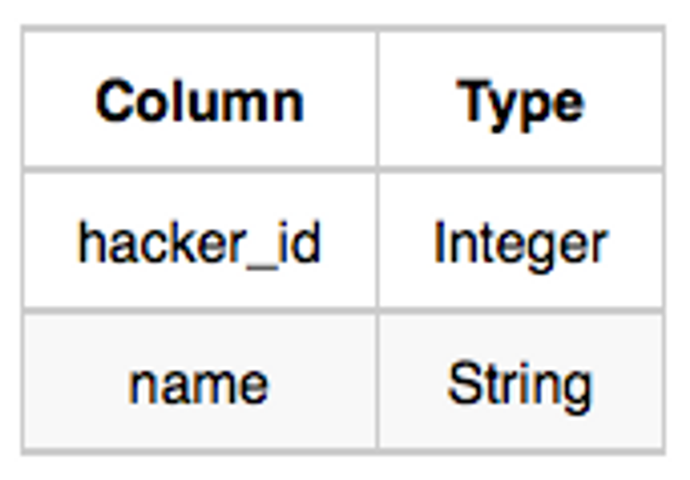
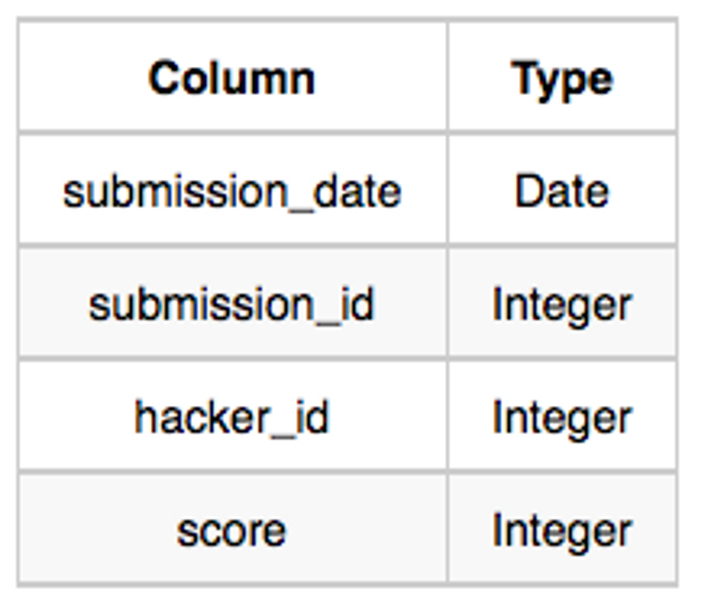
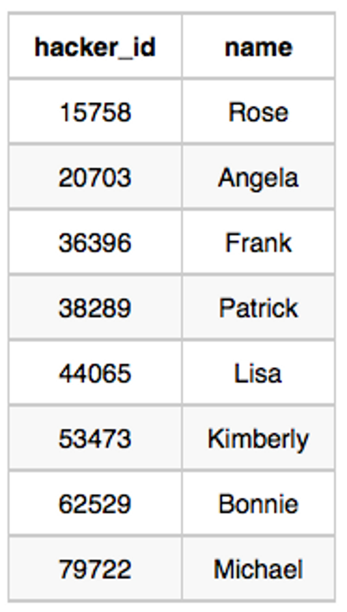
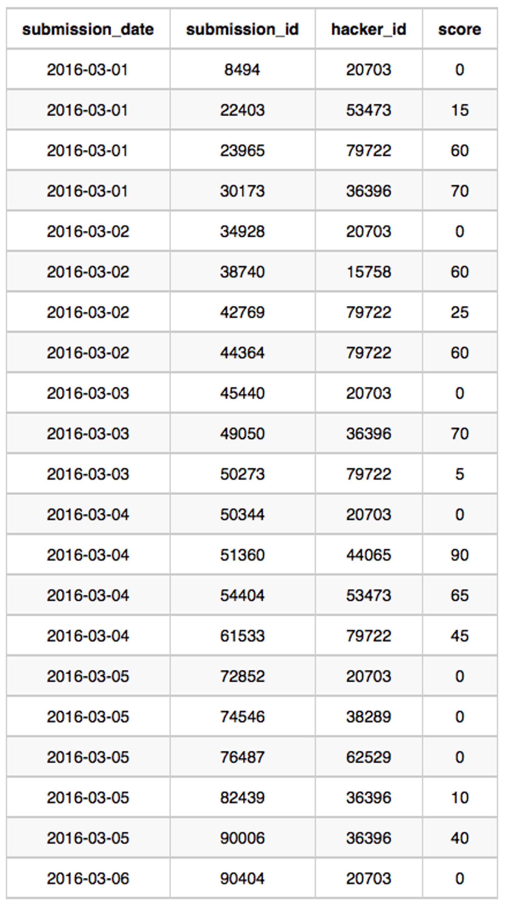

# DDL, DML

```sql
CERATE TABLE hackers(
	hacker_id INT PRIMARY KEY
	, name VARHCHAR(20)
);

CREATE TABLE submissions(
	submission_date DATE
	, submission_id INT PRIMARY KEY
	, hacker_id INT
	, score INT
);

INSERT INTO hackers VALUES (15758, Rose);
INSERT INTO hackers VALUES (20703, Angela);
INSERT INTO hackers VALUES (36396, Frank);
INSERT INTO hackers VALUES (38289, Patrick);
INSERT INTO hackers VALUES (44065, Lisa);
INSERT INTO hackers VALUES (53473, Kimberly);
INSERT INTO hackers VALUES (62529, Bonnie);
INSERT INTO hackers VALUES (79722, Michael);

INSERT INTO submissions VALUES (2016-03-01, 8494, 20703, 0);
INSERT INTO submissions VALUES (2016-03-01, 22403, 53473, 15);
INSERT INTO submissions VALUES (2016-03-01, 23965, 79722, 60);
INSERT INTO submissions VALUES (2016-03-01, 30173, 36396, 70);
INSERT INTO submissions VALUES (2016-03-02, 34928, 20703, 0);
INSERT INTO submissions VALUES (2016-03-02, 38740, 15758, 60);
INSERT INTO submissions VALUES (2016-03-02, 42769, 79722, 25);
INSERT INTO submissions VALUES (2016-03-02, 44364, 79722, 60);
INSERT INTO submissions VALUES (2016-03-03, 45440, 20703, 0);
INSERT INTO submissions VALUES (2016-03-03, 49050, 36396, 70);
INSERT INTO submissions VALUES (2016-03-03, 50273, 79722, 5);
INSERT INTO submissions VALUES (2016-03-04, 50344, 20703, 0);
INSERT INTO submissions VALUES (2016-03-04, 51360, 44065, 90);
INSERT INTO submissions VALUES (2016-03-04, 54404, 53473, 65);
INSERT INTO submissions VALUES (2016-03-04, 61533, 79722, 45);
INSERT INTO submissions VALUES (2016-03-05, 72852, 20703, 0);
INSERT INTO submissions VALUES (2016-03-05, 74546, 38289, 0);
INSERT INTO submissions VALUES (2016-03-05, 76487, 62529, 0);
INSERT INTO submissions VALUES (2016-03-05, 82439, 36396, 10);
INSERT INTO submissions VALUES (2016-03-05, 90006, 36396, 40);
INSERT INTO submissions VALUES (2016-03-05, 90404, 20703, 0);
```

# Question

Julia conducted a `15` days of learning SQL contest. The start date of the contest was *March 01, 2016* and the end date was *March 15, 2016*.

Write a query to print total number of unique hackers who made at least `1` submission each day (starting on the first day of the contest), and find the *hacker_id* and *name* of the hacker who made maximum number of submissions each day. If more than one such hacker has a maximum number of submissions, print the lowest *hacker_id*. The query should print this information for each day of the contest, sorted by the date.

---

**Input Format**

The following tables hold contest data:

- *Hackers:* The *hacker_id* is the id of the hacker, and *name* is the name of the hacker.
    
    
    
- *Submissions:* The *submission_date* is the date of the submission, *submission_id* is the id of the submission, *hacker_id* is the id of the hacker who made the submission, and *score* is the score of the submission.
    
    
    

**Sample Input**

For the following sample input, assume that the end date of the contest was *March 06, 2016*.

*Hackers*

Table:



*Submissions*

Table:



**Sample Output**

`2016-03-01 4 20703 Angela
2016-03-02 2 79722 Michael
2016-03-03 2 20703 Angela
2016-03-04 2 20703 Angela
2016-03-05 1 36396 Frank
2016-03-06 1 20703 Angela`

**Explanation**

On *March 01, 2016* hackers `20703`, `36396` , `53473` , and `79722` made submissions. There are `4` unique hackers who made at least one submission each day. As each hacker made one submission, `20703` is considered to be the hacker who made maximum number of submissions on this day. The name of the hacker is *Angela*.

On *March 02, 2016* hackers `15758`, `20703` , and `79722` made submissions. Now `20703` and  were the only ones to submit every day, so there are `2` unique hackers who made at least one submission each day. `79722`  made `2` submissions, and name of the hacker is *Michael*.

On *March 03, 2016* hackers `20703`, `30396` ,  `79722` and  made submissions. Now `20703` and `79722`  were the only ones, so there are `2` unique hackers who made at least one submission each day. As each hacker made one submission so `20703`  is considered to be the hacker who made maximum number of submissions on this day. The name of the hacker is *Angela*.

On *March 04, 2016* hackers `20703` , `44065` , `53473` , and `79722` made submissions. Now `20703`  and `79722`  only submitted each day, so there are `2` unique hackers who made at least one submission each day. As each hacker made one submission so `20703`  is considered to be the hacker who made maximum number of submissions on this day. The name of the hacker is *Angela*.

On *March 05, 2016* hackers `20703` ,`36396` , `38289`  and `62529` made submissions. Now `20703`  only submitted each day, so there is only `1` unique hacker who made at least one submission each day. `36396`  made `2` submissions and name of the hacker is *Frank*.

On *March 06, 2016* only `20703`  made submission, so there is only `1` unique hacker who made at least one submission each day.  made  submission and name of the hacker is *Angela*.

# Answer

```sql
SELECT
    sub.submission_date
    , every.cnt
    , max_id.hacker_id
    , ha.name
FROM submissions as sub
JOIN
    (
        SELECT 
            s1.submission_date
            , COUNT(DISTINCT s1.hacker_id) as cnt
        FROM submissions as s1
        WHERE (
            SELECT
                COUNT(DISTINCT submission_date)
            FROM submissions as s2
            WHERE s1.hacker_id = s2.hacker_id
                AND s1.submission_date > s2.submission_date
        ) = (s1.submission_date - DATE('2016-03-01'))
        GROUP BY submission_date
    ) AS every ON sub.submission_date = every.submission_date
JOIN
    (
        SELECT 
            submission_date
            , hacker_id
        FROM submissions as s1
        WHERE hacker_id = (
            SELECT
                hacker_id
            FROM submissions as s2
            WHERE s2.submission_date = s1.submission_date
            GROUP BY hacker_id
            ORDER BY count(submission_id) desc, hacker_id asc 
            LIMIT 1
        )
    ) AS max_id ON max_id.submission_date = sub.submission_date
JOIN hackers as ha on max_id.hacker_id = ha.hacker_id
GROUP BY sub.submission_date, every.cnt, max_id.hacker_id, ha.name
ORDER BY sub.submission_date;
```

# 설명

매일 제출한 데이터를 추출 필요

2번째 Column을 추출하기 위한  서브 쿼리

서브 쿼리에 있는 COUNT는 시작일 부터 마지막 날짜까지의 차이와 동일해야 함

특정 ID 가 해당 서브쿼리에서 나온 값이 15(’2016-03-15’ - ‘2016-03-01’) 여야 함

```sql
SELECT 
    s1.submission_date
    , COUNT(DISTINCT s1.hacker_id) as cnt
FROM submissions as s1
WHERE (
    SELECT
        COUNT(DISTINCT submission_date)
    FROM submissions as s2
    WHERE s1.hacker_id = s2.hacker_id
        AND s1.submission_date > s2.submission_date
) = (s1.submission_date - DATE('2016-03-01'))
GROUP BY submission_date
```

---

날짜 별로 가장 많이 내고, ID 값이 작은 것을 추출 필요 

3, 4번째 column을 추출하기 위한 서브 쿼리

정렬 조건

우선 순위

1. 가장 많이 낸 ID 
2. ID 값이 가장 낮은

LIMIT 1 을 통하여 상위 1개만 추출하여 문제의 조건을 충족

```sql
SELECT 
    submission_date
    , hacker_id
FROM submissions as s1
WHERE hacker_id = (
    SELECT
        hacker_id
    FROM submissions as s2
    WHERE s2.submission_date = s1.submission_date
    GROUP BY hacker_id
    ORDER BY count(submission_id) desc, hacker_id asc 
    LIMIT 1
```15 Days of Learning SQL