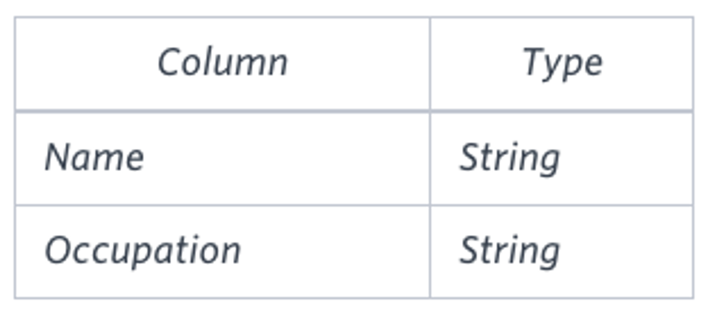

# Question

You are given a table, *BST*, containing two columns: *N* and *P,* where *N* represents the value of a node in *Binary Tree*, and *P* is the parent of *N*.



Write a query to find the node type of *Binary Tree* ordered by the value of the node. Output one of the following for each node:

- *Root*: If node is root node.
- *Leaf*: If node is leaf node.
- *Inner*: If node is neither root nor leaf node.

**Sample Input**


**Sample Output**

```
1 Leaf
2 Inner
3 Leaf
5 Root
6 Leaf
8 Inner
9 Leaf

```

**Explanation**

The *Binary Tree* below illustrates the sample:


# Answer

```sql
SELECT
    n AS position
    , ( 
        CASE WHEN p is NULL THEN 'Root'
        WHEN n not in (SELECT DISTINCT p FROM bst WHERE p is not NULL) THEN 'Leaf'
        ELSE 'Inner'  END
    ) AS nodeType
FROM bst
ORDER BY n
```