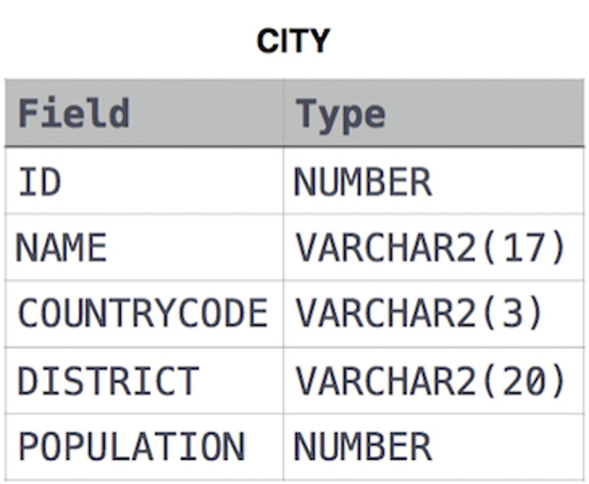

# Questions

Query all columns for all American cities in the **CITY** table with populations larger than `100000`. The **CountryCode** for America is `USA`.

The **CITY** table is described as follows:



# Answer

```sql
SELECT 
	id
	, name
	, countrycode
	, district
	, population
FROM CITY 
WHERE countrycode = 'USA' 
AND population > 100000;
```