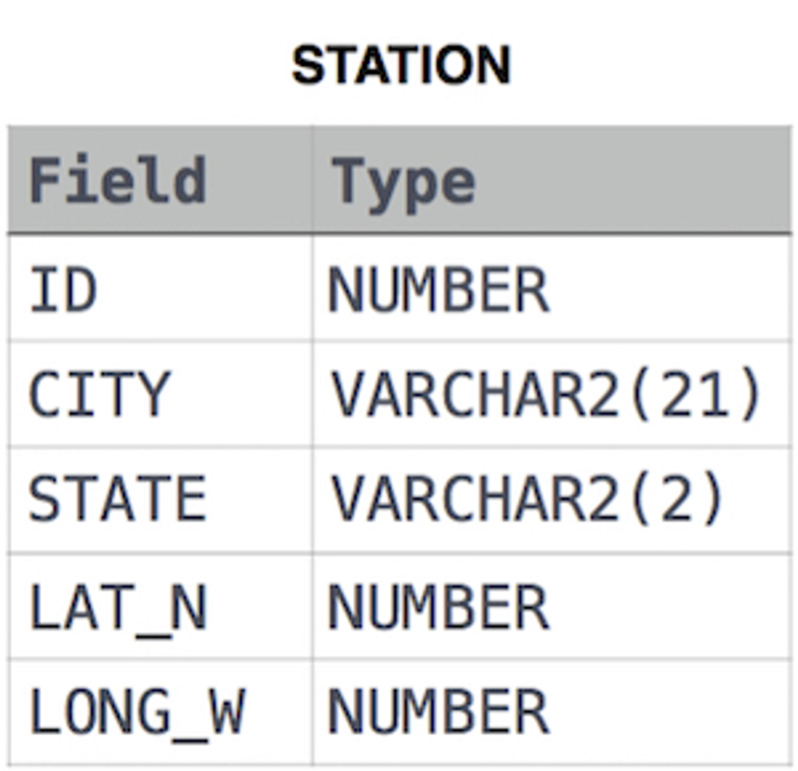

# Questions

Query the list of *CITY* names from **STATION** that *do not start* with vowels. Your result cannot contain duplicates.

**Input Format**

The **STATION** table is described as follows:



where *LAT_N* is the northern latitude and *LONG_W* is the western longitude.

# Answer

```sql
SELECT DISTINCT 
    CITY
FROM station
WHERE city regexp '(^(?![a|e|i|o|u]))'
AND LAT_N > 0
AND LONG_W > 0;
```