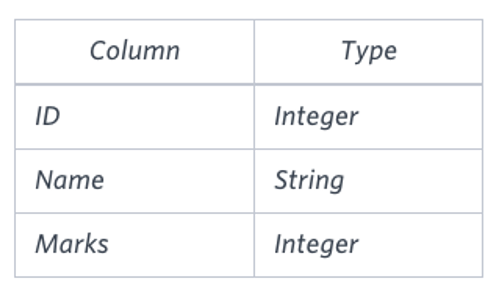
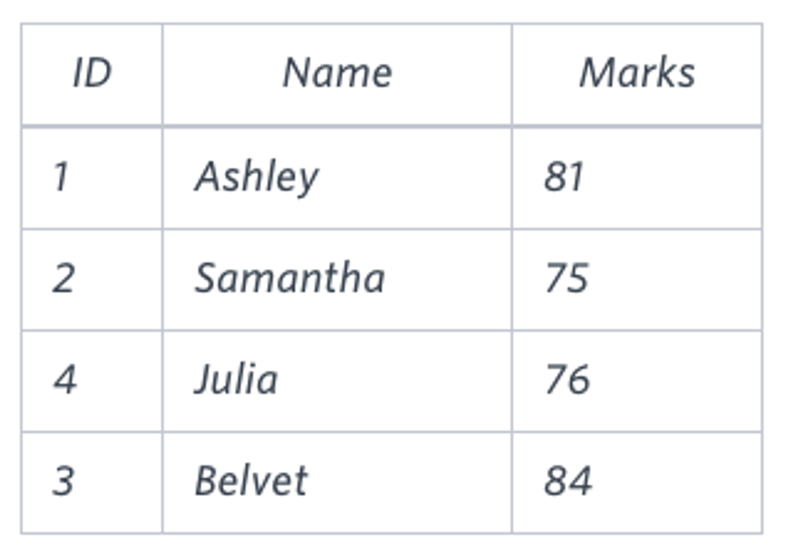

# Question

Query the *Name* of any student in **STUDENTS** who scored higher than `75` *Marks*. Order your output by the *last three characters* of each name. If two or more students both have names ending in the same last three characters (i.e.: Bobby, Robby, etc.), secondary sort them by ascending *ID*.

**Input Format**



The **STUDENTS** table is described as follows:

column only contains uppercase (`A`-`Z`) and lowercase (`a`-`z`) letters.

**Sample Input**



**Sample Output**

```
Ashley
Julia
Belvet
```

**Explanation**

Only Ashley, Julia, and Belvet have *Marks* > `75` . If you look at the last three characters of each of their names, there are no duplicates and 'ley' < 'lia' < 'vet'.

# Answer

```sql
SELECT
    name
FROM students
WHERE marks > 75
ORDER BY SUBSTRING(name, -3, 3), id;
```