# Question

Samantha interviews many candidates from different colleges using coding challenges and contests. Write a query to print the *contest_id*, *hacker_id*, *name*, and the sums of *total_submissions*, *total_accepted_submissions*, *total_views*, and *total_unique_views* for each contest sorted by *contest_id*. Exclude the contest from the result if all four sums are `0`.

**Note:** A specific contest can be used to screen candidates at more than one college, but each college only holds `1` screening contest.

---

**Input Format**

The following tables hold interview data:

- *Contests:* The *contest_id* is the id of the contest, *hacker_id* is the id of the hacker who created the contest, and *name* is the name of the hacker.
    
    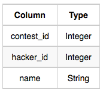
    
- *Colleges:* The *college_id* is the id of the college, and *contest_id* is the id of the contest that Samantha used to screen the candidates.
    
    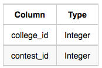
    
- *Challenges:* The *challenge_id* is the id of the challenge that belongs to one of the contests whose contest_id Samantha forgot, and *college_id* is the id of the college where the challenge was given to candidates.
    
    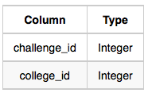
    
- *View_Stats:* The *challenge_id* is the id of the challenge, *total_views* is the number of times the challenge was viewed by candidates, and *total_unique_views* is the number of times the challenge was viewed by unique candidates.
    
    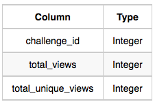
    
- *Submission_Stats:* The *challenge_id* is the id of the challenge, *total_submissions* is the number of submissions for the challenge, and *total_accepted_submission* is the number of submissions that achieved full scores.
    
    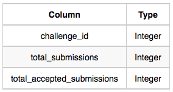
    

---

**Sample Input**

*Contests*

Table:

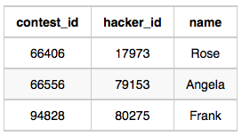

*Colleges*

Table:

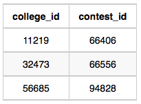

*Challenges*

Table:

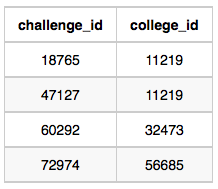

*View_Stats*

Table:

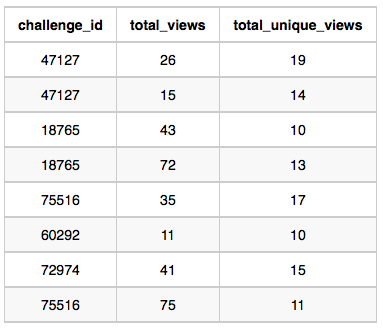

*Submission_Stats*

Table:

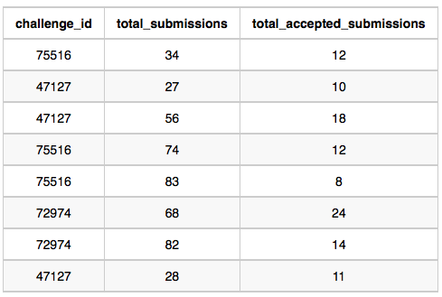

**Sample Output**

`66406 17973 Rose 111 39 156 56
66556 79153 Angela 0 0 11 10
94828 80275 Frank 150 38 41 15`

**Explanation**

The contest `66406` is used in the college `11219`. In this college `11219`, challenges `18765` and `47127` are asked, so from the *view* and *submission* stats:

- Sum of total submissions = 27 + 56 + 28 = 111
- Sum of total accepted submissions = 10 + 18 + 11 = 39
- Sum of total views = 43 + 72 + 26 + 15 = 156
- Sum of total unique views = 10 + 13 + 19 + 14 = 56

Similarly, we can find the sums for contests `66556` and `94528`.

# Answer

```sql
SELECT
    con.contest_id
    , con.hacker_id
    , con.name
    , tol.total_submissions AS total_submissions
    , tol.total_accepted_submissions AS total_accepted_submissions
    , tol.total_views AS total_views
    , tol.total_unique_views AS total_unique_views
FROM contests as con
LEFT JOIN (
    SELECT
        col.contest_id
        , SUM(t.total_submissions) AS total_submissions
        , SUM(t.total_accepted_submissions) AS total_accepted_submissions
        , SUM(t.total_views) AS total_views
        , SUM(t.total_unique_views) AS total_unique_views
    FROM colleges as col
    LEFT JOIN (
        SELECT
            c.college_id
            , SUM(s.total_submissions) AS total_submissions
            , SUM(s.total_accepted_submissions) AS total_accepted_submissions
            , SUM(v.total_views) AS total_views
            , SUM(v.total_unique_views) AS total_unique_views
        FROM challenges AS c
        LEFT JOIN (
                SELECT
                challenge_id
                , SUM(total_submissions) AS total_submissions
                , SUM(total_accepted_submissions) AS total_accepted_submissions
            FROM submission_stats
            WHERE total_submissions > 0 AND total_accepted_submissions > 0
            GROUP BY challenge_id
        ) AS s ON c.challenge_id = s.challenge_id
        LEFT JOIN (
            SELECT
                challenge_id
                , SUM(total_views) AS total_views
                , SUM(total_unique_views) AS total_unique_views
            FROM view_stats
            WHERE total_views > 0 AND total_unique_views > 0
            GROUP BY challenge_id
        ) AS v ON c.challenge_id = v.challenge_id
        GROUP BY c.college_id
    ) AS t ON col.college_id = t.college_id
    GROUP BY contest_id
) AS tol ON con.contest_id = tol.contest_id
    WHERE tol.total_submissions > 0 AND tol.total_accepted_submissions > 0 AND tol.total_views > 0 AND tol.total_unique_views > 0
```

# 해설
해당 문제는 JOIN이 많은 문제이다. 
JOIN이 많은 문제는 테이블 간의 관계 파악이 우선순위로 생각해야 하며,
DATA가 가장 적은 TABLE 부터 많은 순으로 가는 것이 좋다 (성능적으로)
하지만 논리 구조적으로 그렇지 않은 경우는 당연히 논리적으로 가야한다.

해당 테이블은 아래와 같은 구조를 가지고 있다.
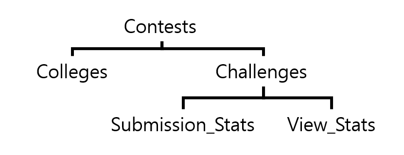

또, 전체의 합을 구하는 문제이므로 어디서 Group BY를 해야 하는지 중점적으로 생각하며 접근하면 빠르게 문제 해결이 가능할것이다.

GROUP BY, 집계 함수가 많아... 비용이 너무 증가한다......
고쳐야한다....