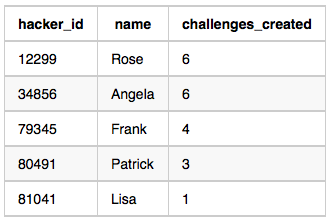

# Question

Julia asked her students to create some coding challenges. Write a query to print the *hacker_id*, *name*, and the total number of challenges created by each student. Sort your results by the total number of challenges in descending order. If more than one student created the same number of challenges, then sort the result by *hacker_id*. If more than one student created the same number of challenges and the count is less than the maximum number of challenges created, then exclude those students from the result.

**Input Format**

The following tables contain challenge data:

- *Hackers:* The *hacker_id* is the id of the hacker, and *name* is the name of the hacker.
    
    
    
- *Challenges:* The *challenge_id* is the id of the challenge, and *hacker_id* is the id of the student who created the challenge.
    
    
    

---

**Sample Input 0**

*Hackers* Table:


*Challenges* Table:


**Sample Output 0**

```
21283 Angela 6
88255 Patrick 5
96196 Lisa 1

```

**Sample Input 1**

*Hackers* Table:


*Challenges* Table:


**Sample Output 1**

```
12299 Rose 6
34856 Angela 6
79345 Frank 4
80491 Patrick 3
81041 Lisa 1

```

**Explanation**

For *Sample Case 0*, we can get the following details:


Students`5077` and `62743` both created `4`challenges, but the maximum number of challenges created is `6`

so these students are excluded from the result. 

For *Sample Case 1*, we can get the following details:



Students `12299` and `34856` both created `6` challenges. Because `6` is the maximum number of challenges created, these students are included in the result.

# Answer

```sql
WITH cnt AS(
    SELECT
        hackers.hacker_id AS hacker_id
        , hackers.name AS name
        , COUNT(*) AS challenges_created
    FROM hackers
    JOIN challenges
        ON hackers.hacker_id = challenges.hacker_id
    GROUP BY hacker_id, name
)

SELECT
    hacker_id
    , name
    , challenges_created
FROM cnt
WHERE challenges_created = (SELECT MAX(challenges_created) FROM cnt)
    OR challenges_created IN (
        SELECT
            challenges_created
        FROM cnt
        GROUP BY challenges_created
        HAVING COUNT(*) = 1
    )
ORDER BY challenges_created DESC, hacker_id ASC
```

# 검증

### No. 1

```sql
SELECT
    hackers.hacker_id AS hacker_id
    , hackers.name AS name
    , COUNT(*) AS challenges_created
FROM hackers
JOIN challenges
    ON hackers.hacker_id = challenges.hacker_id
GROUP BY hacker_id, name
```

```
46963 Barbara 31
26332 Melissa 3
5120 Julia 50
81589 Julia 2
31955 Harry 3
1315 Kimberly 2
33069 Ruth 2
83045 Ralph 3
23428 Arthur 33
```

### No. 2

```sql
WITH cnt AS(
    SELECT
        hackers.hacker_id AS hacker_id
        , hackers.name AS name
        , COUNT(*) AS challenges_created
    FROM hackers
    JOIN challenges
        ON hackers.hacker_id = challenges.hacker_id
    GROUP BY hacker_id, name
)

SELECT MAX(challenges_created) FROM cnt
```

```
50
```

### No. 3

```sql
WITH cnt AS(
    SELECT
        hackers.hacker_id AS hacker_id
        , hackers.name AS name
        , COUNT(*) AS challenges_created
    FROM hackers
    JOIN challenges
        ON hackers.hacker_id = challenges.hacker_id
    GROUP BY hacker_id, name
)

SELECT
    challenges_created
FROM cnt
GROUP BY challenges_created
HAVING COUNT(*) = 1
ORDER BY challenges_created DESC
```

```
42
41
40
37
36
35
34
33
32
```