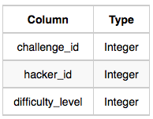
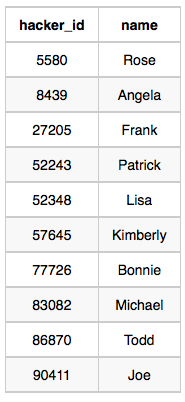
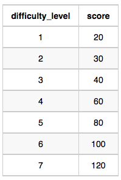
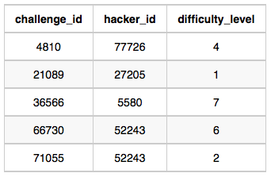
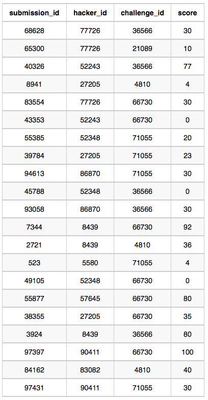

# Question

Julia just finished conducting a coding contest, and she needs your help assembling the leaderboard! Write a query to print the respective *hacker_id* and *name* of hackers who achieved full scores for *more than one* challenge. Order your output in descending order by the total number of challenges in which the hacker earned a full score. If more than one hacker received full scores in same number of challenges, then sort them by ascending *hacker_id*.

---

**Input Format**

The following tables contain contest data:

- *Hackers:* The *hacker_id* is the id of the hacker, and *name* is the name of the hacker.
    
    
    
- *Difficulty:* The *difficult_level* is the level of difficulty of the challenge, and *score* is the score of the challenge for the difficulty level.
    
    
    
- *Challenges:* The *challenge_id* is the id of the challenge, the *hacker_id* is the id of the hacker who created the challenge, and *difficulty_level* is the level of difficulty of the challenge.
    
    
    
- *Submissions:* The *submission_id* is the id of the submission, *hacker_id* is the id of the hacker who made the submission, *challenge_id* is the id of the challenge that the submission belongs to, and *score* is the score of the submission.
    
    
    

---

**Sample Input**

*Hackers*

Table:



*Difficulty*

Table:



*Challenges*

Table:



*Submissions*

Table:



**Sample Output**

`90411 Joe`

**Explanation**

Hacker *86870* got a score of *30* for challenge *71055* with a difficulty level of *2*, so *86870* earned a full score for this challenge.

Hacker *90411* got a score of *30* for challenge *71055* with a difficulty level of *2*, so *90411* earned a full score for this challenge.

Hacker *90411* got a score of *100* for challenge *66730* with a difficulty level of *6*, so *90411* earned a full score for this challenge.

Only hacker *90411* managed to earn a full score for more than one challenge, so we print the their *hacker_id* and *name* as `2` space-separated values.

# Answer

```sql
SELECT
    s.hacker_id
    , h.name
FROM submissions AS s
-- NULL을 포함하지 않기 위하여 INNER JOIN 진행
JOIN challenges AS c
    ON s.challenge_id = c.challenge_id
JOIN difficulty AS d
    ON c.difficulty_level = d.difficulty_level
JOIN hackers AS h
    ON h.hacker_id = s.hacker_id
-- 만점인 경우
WHERE s.score = d.score 
GROUP BY s.hacker_id, h.name
-- 2번 이상 만점을 맞은 경우 혹시 NULL 포함될까봐 *,1이 아닌 Column 명으로 진행
HAVING COUNT(s.challenge_id) > 1
ORDER BY COUNT(s.challenge_id) DESC, s.hacker_id ASC
```