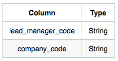

# Question

Amber's conglomerate corporation just acquired some new companies. Each of the companies follows this hierarchy:


Given the table schemas below, write a query to print the *company_code*, *founder* name, total number of *lead* managers, total number of *senior* managers, total number of *managers*, and total number of *employees*. Order your output by ascending *company_code*.

**Note:**

- The tables may contain duplicate records.
- The *company_code* is string, so the sorting should not be **numeric**. For example, if the *company_codes* are *C_1*, *C_2*, and *C_10*, then the ascending *company_codes* will be *C_1*, *C_10*, and *C_2*.

---

**Input Format**

The following tables contain company data:

- *Company:* The *company_code* is the code of the company and *founder* is the founder of the company.
    
    
    
- *Lead_Manager:* The *lead_manager_code* is the code of the lead manager, and the *company_code* is the code of the working company.
    
    
    
- *Senior_Manager:* The *senior_manager_code* is the code of the senior manager, the *lead_manager_code* is the code of its lead manager, and the *company_code* is the code of the working company.
    
    
    
- *Manager:* The *manager_code* is the code of the manager, the *senior_manager_code* is the code of its senior manager, the *lead_manager_code* is the code of its lead manager, and the *company_code* is the code of the working company.
    
    
    
- *Employee:* The *employee_code* is the code of the employee, the *manager_code* is the code of its manager, the *senior_manager_code* is the code of its senior manager, the *lead_manager_code* is the code of its lead manager, and the *company_code* is the code of the working company.
    
    
    

---

**Sample Input**

*Company*

Table:


*Lead_Manager*

Table:


*Senior_Manager*

Table:


*Manager*

Table:


*Employee*

Table:


**Sample Output**

```
C1 Monika 1 2 1 2
C2 Samantha 1 1 2 2
```

**Explanation**

In company *C1*, the only lead manager is *LM1*. There are two senior managers, *SM1* and *SM2*, under *LM1*. There is one manager, *M1*, under senior manager *SM1*. There are two employees, *E1* and *E2*, under manager *M1*.

In company *C2*, the only lead manager is *LM2*. There is one senior manager, *SM3*, under *LM2*. There are two managers, *M2* and *M3*, under senior manager *SM3*. There is one employee, *E3*, under manager *M2*, and another employee, *E4*, under manager, *M3*.

# Answer

```sql
SELECT
    company.company_code
    , company.founder
    , COUNT(DISTINCT lead.lead_manager_code)
    , COUNT(DISTINCT senior.senior_manager_code)
    , COUNT(DISTINCT manager.manager_code)
    , COUNT(DISTINCT employee.employee_code)
FROM company
JOIN lead_manager AS lead
    ON company.company_code = lead.company_code
JOIN senior_manager AS senior
    ON company.company_code = senior.company_code
JOIN manager AS manager
    ON company.company_code = manager.company_code 
JOIN employee AS employee
    ON company.company_code = employee.company_code
GROUP BY company.company_code, company.founder
ORDER BY company.company_code
```