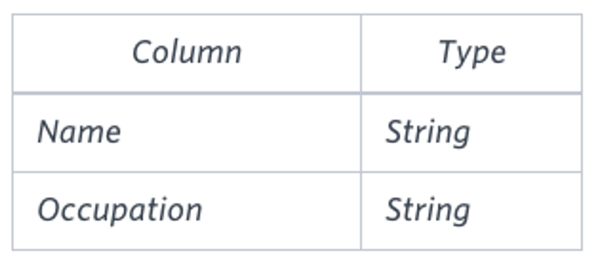

# Question

[Pivot](https://en.wikipedia.org/wiki/Pivot_table) the *Occupation* column in **OCCUPATIONS** so that each *Name* is sorted alphabetically and displayed underneath its corresponding *Occupation*. The output column headers should be *Doctor*, *Professor*, *Singer*, and *Actor*, respectively.

**Note:** Print **NULL** when there are no more names corresponding to an occupation.

**Input Format**

The **OCCUPATIONS** table is described as follows:



*Occupation* will only contain one of the following values: **Doctor**, **Professor**, **Singer** or **Actor**.

**Sample Input**


**Sample Output**

```
Jenny    Ashley     Meera  Jane
Samantha Christeen  Priya  Julia
NULL     Ketty      NULL   Maria
```

**Explanation**

The first column is an alphabetically ordered list of Doctor names.The second column is an alphabetically ordered list of Professor names.The third column is an alphabetically ordered list of Singer names.The fourth column is an alphabetically ordered list of Actor names.The empty cell data for columns with less than the maximum number of names per occupation (in this case, the Professor and Actor columns) are filled with **NULL** values.

# Answer

```sql
SELECT
    MAX(CASE WHEN occupation = 'Doctor' THEN name ELSE NULL END) AS 'Doctor'
    , MAX(CASE WHEN occupation = 'Professor' THEN name ELSE NULL END) AS 'Professor'
    , MAX(CASE WHEN occupation = 'Singer' THEN name ELSE NULL END) AS 'Singer'
    , MAX(CASE WHEN occupation = 'Actor' THEN name ELSE NULL END) AS 'Actor'
FROM(
    SELECT
        occupation
        , name
        , ROW_NUMBER() OVER ( PARTITION by occupation ORDER BY name ) AS 'rank'
    FROM occupations
) AS ranked
GROUP BY ranked.rank;
```

```
Aamina Ashley Christeen Eve
Julia Belvet Jane Jennifer
Priya Britney Jenny Ketty
NULL Maria Kristeen Samantha
NULL Meera NULL NULL
NULL Naomi NULL NULL
NULL Priyanka NULL NULL
```


# 검증
### No. 1
```sql
SELECT 
    name
    , occupation
FROM occupations
```

```
Ashley Professor
Samantha Actor
Julia Doctor
Britney Professor
Maria Professor
Meera Professor
Priya Doctor
Priyanka Professor
Jennifer Actor
Ketty Actor
Belvet Professor
Naomi Professor
Jane Singer
Jenny Singer
Kristeen Singer
Christeen Singer
Eve Actor
Aamina Doctor
```

### No. 2
```sql
SELECT
    occupation
    , name
    , ROW_NUMBER() OVER ( PARTITION by occupation ORDER BY name ) AS 'rank'
FROM occupations
```

```
Actor Eve 1
Actor Jennifer 2
Actor Ketty 3
Actor Samantha 4
Doctor Aamina 1
Doctor Julia 2
Doctor Priya 3
Professor Ashley 1
Professor Belvet 2
Professor Britney 3
Professor Maria 4
Professor Meera 5
Professor Naomi 6
Professor Priyanka 7
Singer Christeen 1
Singer Jane 2
Singer Jenny 3
Singer Kristeen 4
```


### No. 3
```sql
SELECT
    MAX(CASE WHEN occupation = 'Doctor' THEN name ELSE NULL END) AS 'Doctor'
    , MAX(CASE WHEN occupation = 'Professor' THEN name ELSE NULL END) AS 'Professor'
    , MAX(CASE WHEN occupation = 'Singer' THEN name ELSE NULL END) AS 'Singer'
    , MAX(CASE WHEN occupation = 'Actor' THEN name ELSE NULL END) AS 'Actor'
FROM occupations
```

```
Priya Priyanka Kristeen Samantha

# occupation | name | (No.2 Table Last)Row_number
# Doctor | Priya | 3 
# Professor | Priyanka | 7
# Singer | Kristeen | 4
# Actor | Samantha | 4
```

```sql
SELECT
    MIN(CASE WHEN occupation = 'Doctor' THEN name ELSE NULL END) AS 'Doctor'
    , MIN(CASE WHEN occupation = 'Professor' THEN name ELSE NULL END) AS 'Professor'
    , MIN(CASE WHEN occupation = 'Singer' THEN name ELSE NULL END) AS 'Singer'
    , MIN(CASE WHEN occupation = 'Actor' THEN name ELSE NULL END) AS 'Actor'
FROM occupations
```

```
Aamina Ashley Christeen Eve

# occupation | name | (No.2 Table First)Row_number
# Doctor | Aamina | 1
# Professor | Ashley | 1
# Singer | Christeen | 1
# Actor | Eve | 1
```

### No. 4
```sql
-- ORDER BY rank desc
SELECT
    MAX(CASE WHEN occupation = 'Doctor' THEN name ELSE NULL END) AS 'Doctor'
    , MAX(CASE WHEN occupation = 'Professor' THEN name ELSE NULL END) AS 'Professor'
    , MAX(CASE WHEN occupation = 'Singer' THEN name ELSE NULL END) AS 'Singer'
    , MAX(CASE WHEN occupation = 'Actor' THEN name ELSE NULL END) AS 'Actor'
FROM(
    SELECT
        occupation
        , name
        , ROW_NUMBER() OVER ( PARTITION by occupation ORDER BY name ) AS 'rank'
    FROM occupations
) AS ranked
GROUP BY ranked.rank;

-- ORDER BY rank asc
SELECT
    MIN(CASE WHEN occupation = 'Doctor' THEN name ELSE NULL END) AS 'Doctor'
    , MIN(CASE WHEN occupation = 'Professor' THEN name ELSE NULL END) AS 'Professor'
    , MIN(CASE WHEN occupation = 'Singer' THEN name ELSE NULL END) AS 'Singer'
    , MIN(CASE WHEN occupation = 'Actor' THEN name ELSE NULL END) AS 'Actor'
FROM(
    SELECT
        occupation
        , name
        , ROW_NUMBER() OVER ( PARTITION by occupation ORDER BY name ) AS 'rank'
    FROM occupations
) AS ranked
GROUP BY ranked.rank;
```