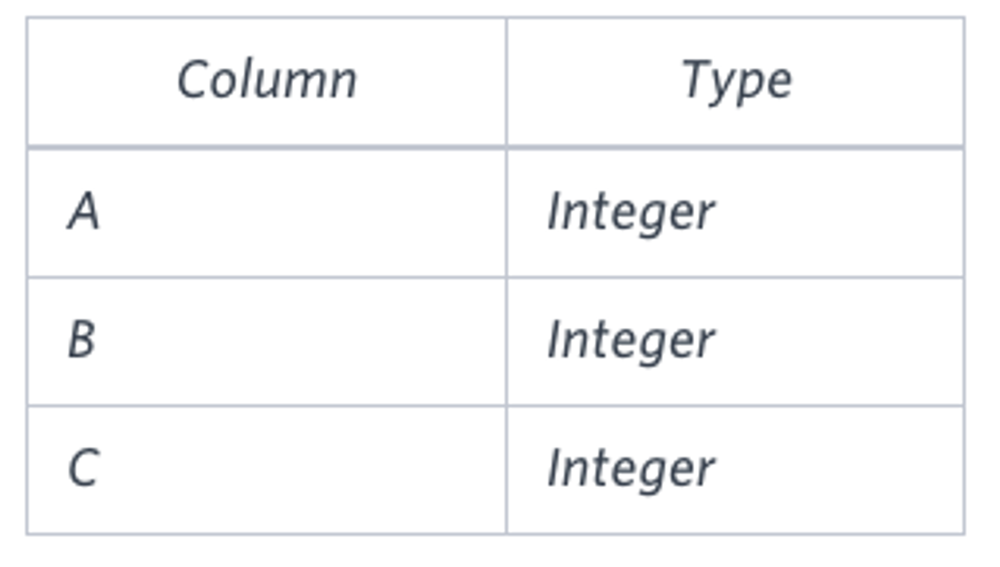
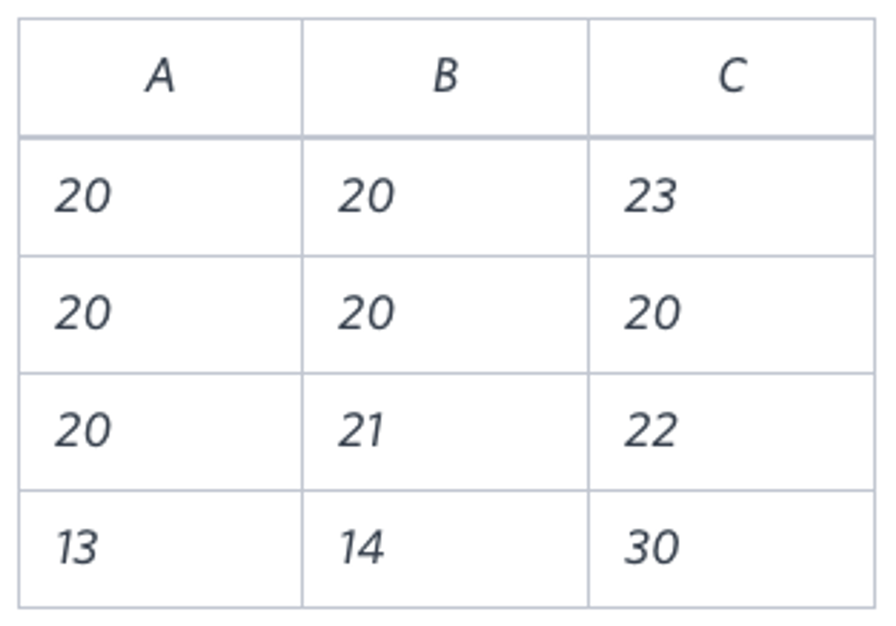

# Question

Write a query identifying the *type* of each record in the **TRIANGLES** table using its three side lengths. Output one of the following statements for each record in the table:

- **Equilateral**: It's a triangle with  sides of equal length.
- **Isosceles**: It's a triangle with  sides of equal length.
- **Scalene**: It's a triangle with  sides of differing lengths.
- **Not A Triangle**: The given values of *A*, *B*, and *C* don't form a triangle.

**Input Format**

The **TRIANGLES** table is described as follows:



Each row in the table denotes the lengths of each of a triangle's three sides.

**Sample Input**



**Sample Output**

```
Isosceles
Equilateral
Scalene
Not A Triangle
```

**Explanation**

Values in the tuple **(20, 20, 23)** form an Isosceles triangle, because **A = B** .

Values in the tuple **(20, 20, 20)** form an Equilateral triangle, because **A = B = C**. 

Values in the tuple **(20,21,22)** form a Scalene triangle, because **A ≠ B ≠ C**.

Values in the tuple **(13, 14, 30)** cannot form a triangle because the combined value of sides **A** and **B** is not larger than that of side **C**.

# Answer

```sql
SELECT
    (
        CASE WHEN (A = B) AND (B = C) THEN 'Equilateral'
        WHEN ( (A + B <= C) OR (B + C <= A) OR (A + C <= B) ) THEN 'Not A Triangle'
        WHEN (A = B) OR (B = C) OR (A = C) THEN 'Isosceles'      
        ELSE 'Scalene'
    END) AS return_value
FROM triangles;
```