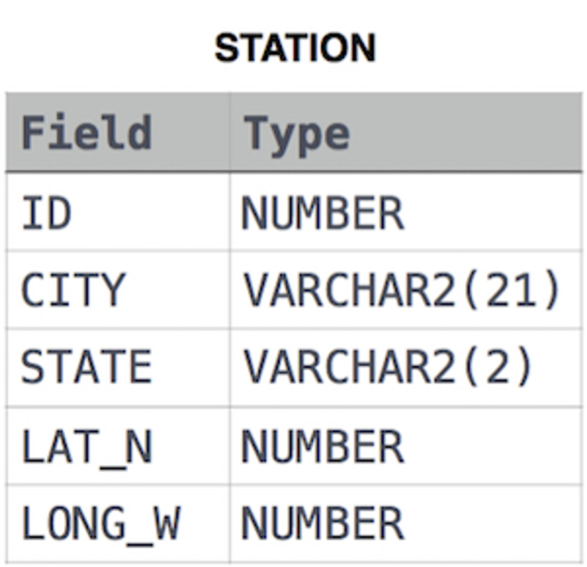

# Question

Query the list of *CITY* names from **STATION** that either do not start with vowels or do not end with vowels. Your result cannot contain duplicates.

**Input Format**

The **STATION** table is described as follows:




where *LAT_N* is the northern latitude and *LONG_W* is the western longitude.

# Answer

```sql
SELECT DISTINCT
    city
FROM station
WHERE city regexp '([^aeiou])$' OR city regexp '(^[^aeiou])'
AND lat_n > 0 and long_w > 0;
```