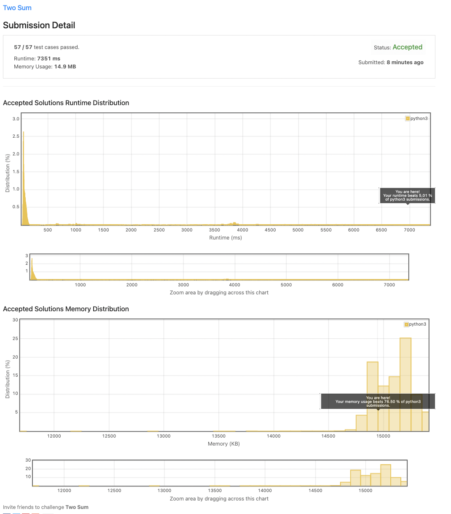
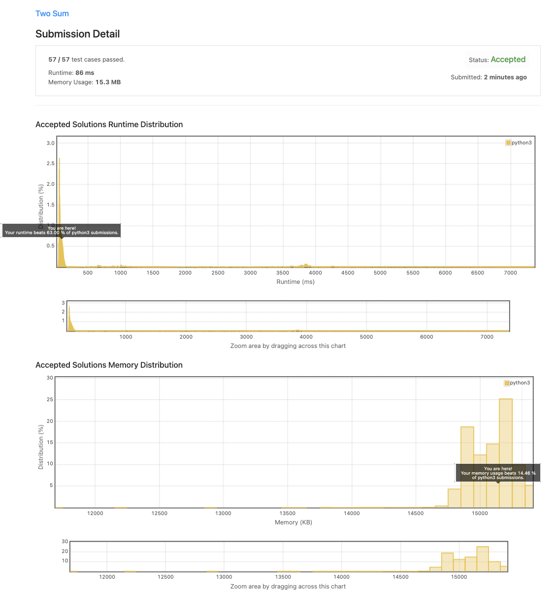

# Question

Given an array of integers `nums` and an integer `target`, return *indices of the two numbers such that they add up to `target`*.

You may assume that each input would have ***exactly* one solution**, and you may not use the *same* element twice.

You can return the answer in any order.

**Example 1:**

```
Input: nums = [2,7,11,15], target = 9
Output: [0,1]
Explanation: Because nums[0] + nums[1] == 9, we return [0, 1].

```

**Example 2:**

```
Input: nums = [3,2,4], target = 6
Output: [1,2]

```

**Example 3:**

```
Input: nums = [3,3], target = 6
Output: [0,1]

```

**Constraints:**

- `2 <= nums.length <= 104`
- `109 <= nums[i] <= 109`
- `109 <= target <= 109`
- **Only one valid answer exists.**

**Follow-up:**

Can you come up with an algorithm that is less than

```
O(n2)
```

time complexity?

# Answer

## 첫번째 답안

```python
class Solution:
    def twoSum(self, nums: List[int], target: int) -> List[int]:
        return_list = []
        for first_index in range(len(nums)):
            for second_index in range(len(nums)):
                if second_index > first_index :
                    if(nums[first_index] + nums[second_index] == target):
                        return_list.append(first_index)
                        return_list.append(second_index)
                        return return_list
```

### 결과


## 두번째 답안

```python
class Solution:
    def twoSum(self, nums: List[int], target: int) -> List[int]:
        checker = {}
        for index, value in enumerate(nums):
            if target - value in checker:
                return [checker[target - value], index]
            else:    
                checker[value] = index
```

### 결과
