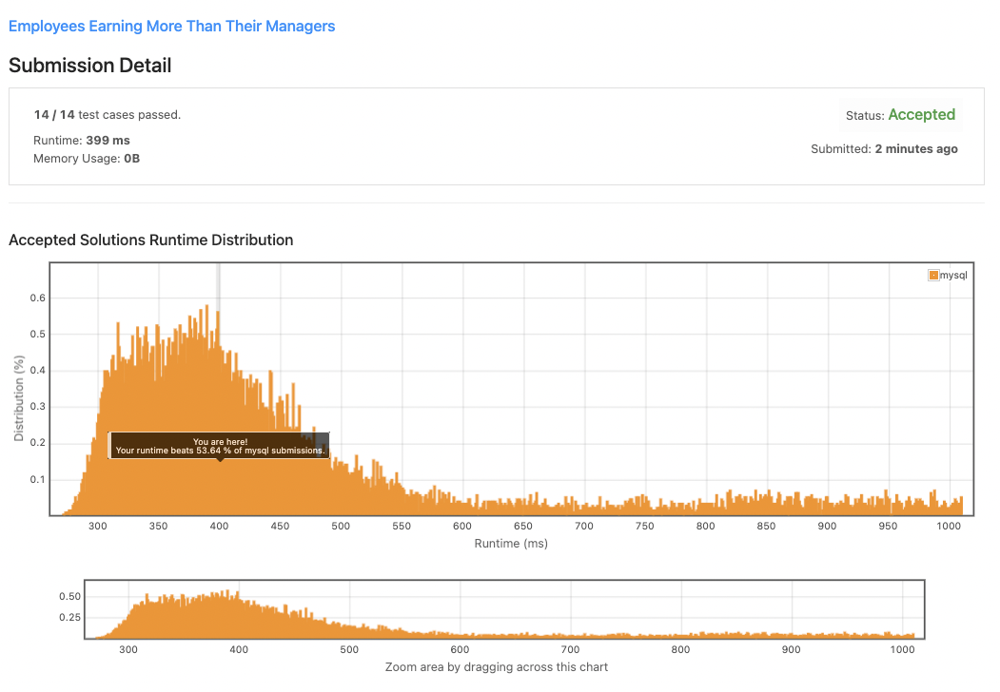
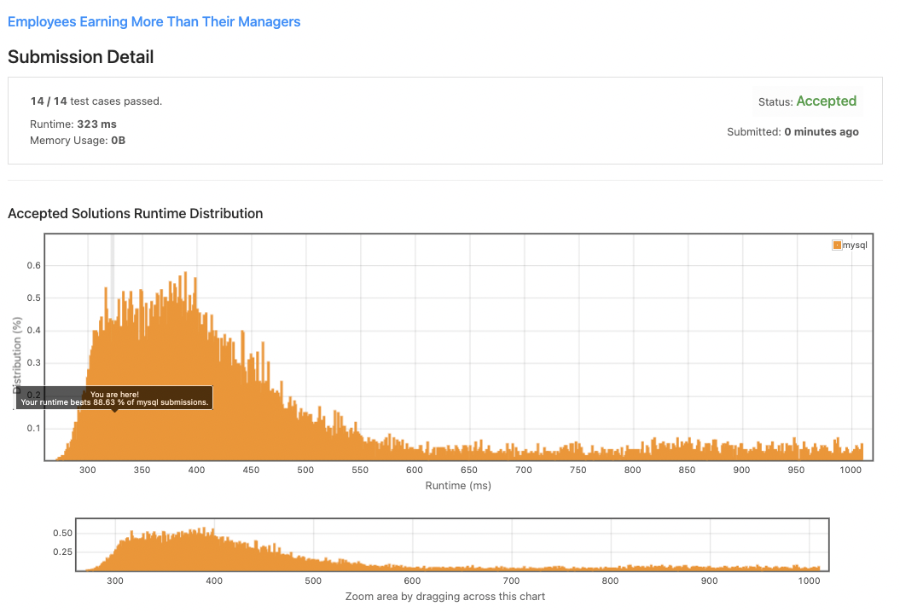

# **181. Employees Earning More Than Their Managers**

# Question

- `SQL Schema`
    
    ```sql
    Create table If Not Exists Employee (id int, name varchar(255), salary int, managerId int)
    Truncate table Employee
    insert into Employee (id, name, salary, managerId) values ('1', 'Joe', '70000', '3')
    insert into Employee (id, name, salary, managerId) values ('2', 'Henry', '80000', '4')
    insert into Employee (id, name, salary, managerId) values ('3', 'Sam', '60000', 'None')
    insert into Employee (id, name, salary, managerId) values ('4', 'Max', '90000', 'None')
    ```
    

Table: `Employee`

```
+-------------+---------+
| Column Name | Type    |
+-------------+---------+
| id          | int     |
| name        | varchar |
| salary      | int     |
| managerId   | int     |
+-------------+---------+
id is the primary key column for this table.
Each row of this table indicates the ID of an employee, their name, salary, and the ID of their manager.

```

Write an SQL query to find the employees who earn more than their managers.

Return the result table in **any order**.

The query result format is in the following example.

**Example 1:**

```
Input:
Employee table:
+----+-------+--------+-----------+
| id | name  | salary | managerId |
+----+-------+--------+-----------+
| 1  | Joe   | 70000  | 3         |
| 2  | Henry | 80000  | 4         |
| 3  | Sam   | 60000  | Null      |
| 4  | Max   | 90000  | Null      |
+----+-------+--------+-----------+
Output:
+----------+
| Employee |
+----------+
| Joe      |
+----------+
Explanation: Joe is the only employee who earns more than his manager.
```

# Answer

## 첫번째 답안
```sql
# Write your MySQL query statement below
select 
 name as Employee
from Employee as e
where
    salary > (select salary from Employee where e.managerId=id)
```

### 실행 결과


## 두번째 답안
```sql
select E1.name as Employee 
from Employee as E1, Employee as E2 
where E1.managerId = E2.id and E1.salary > E2.salary
```

### 실행 결과


## 세번째 답안
```sql
select E1.name as Employee 
from Employee as E1
join Employee as E2
    on E1.managerId = E2.id
where E1.salary > E2.salary
```

### 실행 결과
