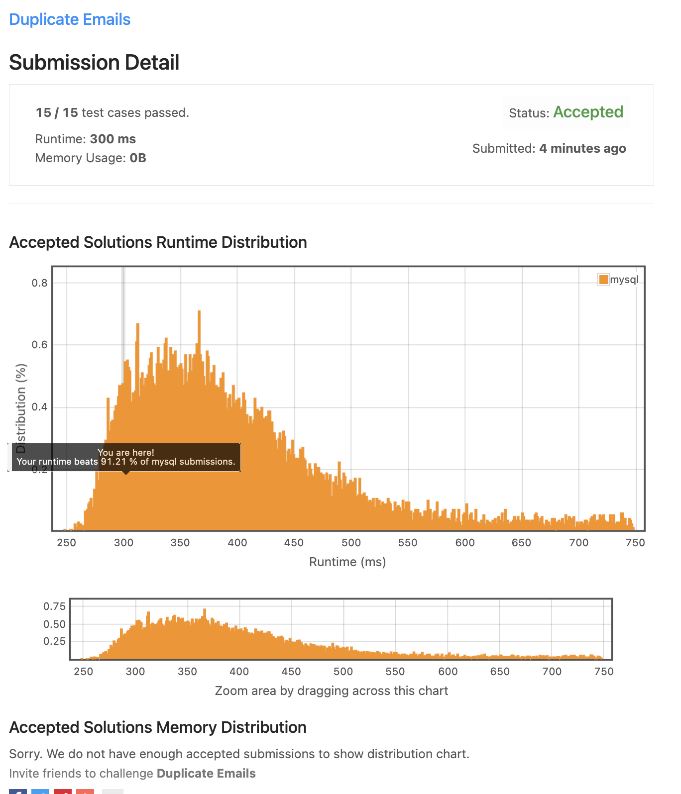

# Question

- `SQL Schema`
    
    ```sql
    Create table If Not Exists Person (id int, email varchar(255))
    Truncate table Person
    insert into Person (id, email) values ('1', 'a@b.com')
    insert into Person (id, email) values ('2', 'c@d.com')
    insert into Person (id, email) values ('3', 'a@b.com')
    ```
    

Table: `Person`

```
+-------------+---------+
| Column Name | Type    |
+-------------+---------+
| id          | int     |
| email       | varchar |
+-------------+---------+
id is the primary key column for this table.
Each row of this table contains an email. The emails will not contain uppercase letters.

```

Write an SQL query to report all the duplicate emails.

Return the result table in **any order**.

The query result format is in the following example.

**Example 1:**

```
Input:
Person table:
+----+---------+
| id | email   |
+----+---------+
| 1  | a@b.com |
| 2  | c@d.com |
| 3  | a@b.com |
+----+---------+
Output:
+---------+
| Email   |
+---------+
| a@b.com |
+---------+
Explanation: a@b.com is repeated two times.
```

# Answer

```sql
select distinct 
    person_1.email
from Person as person_1, Person as person_2
where person_1.id != person_2.id
and person_1.email = person_2.email
```

## 실행결과
