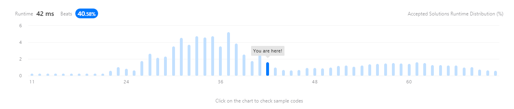

# Question

Given a string `s` containing just the characters `'('`, `')'`, `'{'`, `'}'`, `'['` and `']'`, determine if the input string is valid.

An input string is valid if:

1. Open brackets must be closed by the same type of brackets.
2. Open brackets must be closed in the correct order.
3. Every close bracket has a corresponding open bracket of the same type.

**Example 1:**

```
Input: s = "()"
Output: true

```

**Example 2:**

```
Input: s = "()[]{}"
Output: true

```

**Example 3:**

```
Input: s = "(]"
Output: false

```

**Constraints:**

- `1 <= s.length <= 104`
- `s` consists of parentheses only `'()[]{}'`.

# Answer

## 첫번째 답안

```python
class Solution:
    def isValid(self, s: str) -> bool:
        compare_char = {"(" : ")", "[" : "]", "{" : "}"}
        for idx in range(len(s) - 1) :
            if (idx % 2 == 0 or idx == 0) :
                if(compare_char.get(s[idx]) != s[idx+1]) :
                    return False
        return True
```

Case `"(]"` : ***Failed***

## 두번째 답안

```python
class Solution:
    def isValid(self, s: str) -> bool:
        compare_char = {")" : "(", "]" : "[", "}" : "{"}
        stack = []
        for char in s:
            if char in compare_char.values() : # Open bracket stack push
                stack.append(char)
            else:
                if(stack[-1] == compare_char[char]) : # Stack Top is Open bracket("(", "[", "{") And Compare Close bracket (")", "]", "}")
                    stack.pop() # Compare result is same Type :Stack Pop
                else :
                    return False # Compare result is different type :Return False
        if stack: # Stack is not empty
            return False
        return True
```

Case `"]"` : ***Failed***

## 세번째 답안

```python
class Solution:
    def isValid(self, s: str) -> bool:
        compare_char = {")" : "(", "]" : "[", "}" : "{"}
        stack = []
        for char in s:
            if char in compare_char.values() : # Open bracket stack push
                stack.append(char)
            else:
                if(stack[-1] == compare_char[char] and stack ) : # Stack Top is Open bracket("(", "[", "{") And Compare Close bracket (")", "]", "}")
                    stack.pop() # Compare result is same Type :Stack Pop
                else :
                    return False # Compare result is different type :Return False
        if stack: # Stack is not empty
            return False
        return True
```

***Accepted***

### 실행 결과


