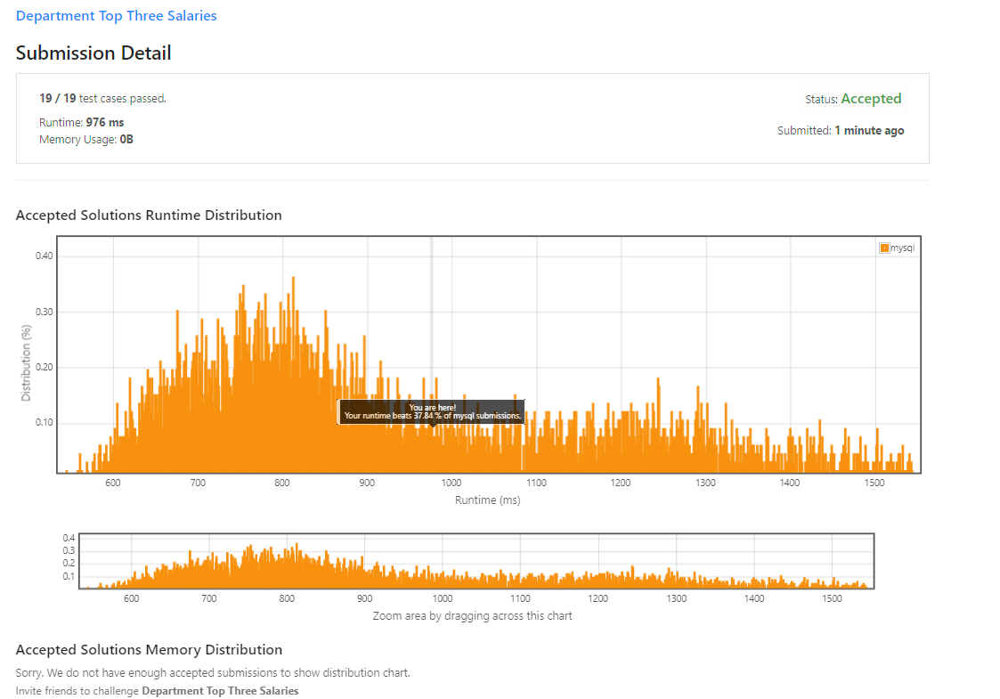

# Question

- `SQL Schema`
    
    ```sql
    Create table If Not Exists Employee (id int, name varchar(255), salary int, departmentId int)
    Create table If Not Exists Department (id int, name varchar(255))
    Truncate table Employee
    insert into Employee (id, name, salary, departmentId) values ('1', 'Joe', '85000', '1')
    insert into Employee (id, name, salary, departmentId) values ('2', 'Henry', '80000', '2')
    insert into Employee (id, name, salary, departmentId) values ('3', 'Sam', '60000', '2')
    insert into Employee (id, name, salary, departmentId) values ('4', 'Max', '90000', '1')
    insert into Employee (id, name, salary, departmentId) values ('5', 'Janet', '69000', '1')
    insert into Employee (id, name, salary, departmentId) values ('6', 'Randy', '85000', '1')
    insert into Employee (id, name, salary, departmentId) values ('7', 'Will', '70000', '1')
    Truncate table Department
    insert into Department (id, name) values ('1', 'IT')
    insert into Department (id, name) values ('2', 'Sales')
    ```
    

Table: `Employee`

```
+--------------+---------+
| Column Name  | Type    |
+--------------+---------+
| id           | int     |
| name         | varchar |
| salary       | int     |
| departmentId | int     |
+--------------+---------+
id is the primary key column for this table.
departmentId is a foreign key of the ID from theDepartmenttable.
Each row of this table indicates the ID, name, and salary of an employee. It also contains the ID of their department.

```

Table: `Department`

```
+-------------+---------+
| Column Name | Type    |
+-------------+---------+
| id          | int     |
| name        | varchar |
+-------------+---------+
id is the primary key column for this table.
Each row of this table indicates the ID of a department and its name.

```

A company's executives are interested in seeing who earns the most money in each of the company's departments. A **high earner** in a department is an employee who has a salary in the **top three unique** salaries for that department.

Write an SQL query to find the employees who are **high earners** in each of the departments.

Return the result table **in any order**.

The query result format is in the following example.

**Example 1:**

```
Input:
Employee table:
+----+-------+--------+--------------+
| id | name  | salary | departmentId |
+----+-------+--------+--------------+
| 1  | Joe   | 85000  | 1            |
| 2  | Henry | 80000  | 2            |
| 3  | Sam   | 60000  | 2            |
| 4  | Max   | 90000  | 1            |
| 5  | Janet | 69000  | 1            |
| 6  | Randy | 85000  | 1            |
| 7  | Will  | 70000  | 1            |
+----+-------+--------+--------------+
Department table:
+----+-------+
| id | name  |
+----+-------+
| 1  | IT    |
| 2  | Sales |
+----+-------+
Output:
+------------+----------+--------+
| Department | Employee | Salary |
+------------+----------+--------+
| IT         | Max      | 90000  |
| IT         | Joe      | 85000  |
| IT         | Randy    | 85000  |
| IT         | Will     | 70000  |
| Sales      | Henry    | 80000  |
| Sales      | Sam      | 60000  |
+------------+----------+--------+
Explanation:
In the IT department:
- Max earns the highest unique salary
- Both Randy and Joe earn the second-highest unique salary
- Will earns the third-highest unique salary

In the Sales department:
- Henry earns the highest salary
- Sam earns the second-highest salary
- There is no third-highest salary as there are only two employees
```

# Answer

```sql
select distinct
    d.name as Department,
    e.name as Employee,
    e.salary as Salary
from Employee as e, Employee as compare_e, Department as d
where e.departmentId = d.id
and e.departmentId  = compare_e.departmentId
and  e.salary <= compare_e.salary
group by d.id,e.Name
having count(distinct compare_e.salary) <= 3
order by d.name, e.salary desc;
```

## 실행 결과
