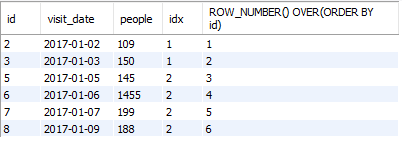
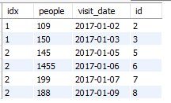

# Question

- `SQL Schema`
    
    ```sql
    Create table If Not Exists Stadium (id int, visit_date DATE NULL, people int)
    Truncate table Stadium
    insert into Stadium (id, visit_date, people) values ('1', '2017-01-01', '10')
    insert into Stadium (id, visit_date, people) values ('2', '2017-01-02', '109')
    insert into Stadium (id, visit_date, people) values ('3', '2017-01-03', '150')
    insert into Stadium (id, visit_date, people) values ('4', '2017-01-04', '99')
    insert into Stadium (id, visit_date, people) values ('5', '2017-01-05', '145')
    insert into Stadium (id, visit_date, people) values ('6', '2017-01-06', '1455')
    insert into Stadium (id, visit_date, people) values ('7', '2017-01-07', '199')
    insert into Stadium (id, visit_date, people) values ('8', '2017-01-09', '188')
    ```
    

Table: `Stadium`

```
+---------------+---------+
| Column Name   | Type    |
+---------------+---------+
| id            | int     |
| visit_date    | date    |
| people        | int     |
+---------------+---------+
visit_date is the primary key for this table.
Each row of this table contains the visit date and visit id to the stadium with the number of people during the visit.
No two rows will have the same visit_date, and as the id increases, the dates increase as well.

```

Write an SQL query to display the records with three or more rows with **consecutive** `id`'s, and the number of people is greater than or equal to 100 for each.

Return the result table ordered by `visit_date` in **ascending order**.

The query result format is in the following example.

**Example 1:**

```
Input:
Stadium table:
+------+------------+-----------+
| id   | visit_date | people    |
+------+------------+-----------+
| 1    | 2017-01-01 | 10        |
| 2    | 2017-01-02 | 109       |
| 3    | 2017-01-03 | 150       |
| 4    | 2017-01-04 | 99        |
| 5    | 2017-01-05 | 145       |
| 6    | 2017-01-06 | 1455      |
| 7    | 2017-01-07 | 199       |
| 8    | 2017-01-09 | 188       |
+------+------------+-----------+
Output:
+------+------------+-----------+
| id   | visit_date | people    |
+------+------------+-----------+
| 5    | 2017-01-05 | 145       |
| 6    | 2017-01-06 | 1455      |
| 7    | 2017-01-07 | 199       |
| 8    | 2017-01-09 | 188       |
+------+------------+-----------+
Explanation:
The four rows with ids 5, 6, 7, and 8 have consecutive ids and each of them has >= 100 people attended. Note that row 8 was included even though the visit_date was not the next day after row 7.
The rows with ids 2 and 3 are not included because we need at least three consecutive ids.
```

# Answer

```sql
WITH cnt AS(
    SELECT
        id
        , visit_date
        , people
        , id - ROW_NUMBER() OVER(ORDER BY id) AS idx
    FROM stadium
    WHERE people >= 100
)
SELECT
    id
    , visit_date
    , people
FROM cnt
WHERE cnt.idx IN (
    SELECT idx FROM cnt 
    GROUP BY idx HAVING COUNT(*) >= 3
)
```

## 실행 결과


## 검증 - 1

```sql
SELECT
    id
    , visit_date
    , people
    , id - ROW_NUMBER() OVER(ORDER BY id) AS idx
    , ROW_NUMBER() OVER(ORDER BY id)
FROM stadium
WHERE people >= 100
```



## 검증 - 2

```sql
SELECT 
	idx
    , people
    , visit_date
    , id 
FROM (
	SELECT
        id
        , visit_date
        , people
        , id - ROW_NUMBER() OVER(ORDER BY id) AS idx
    FROM stadium
    WHERE people >= 100) AS cnt ;
```

