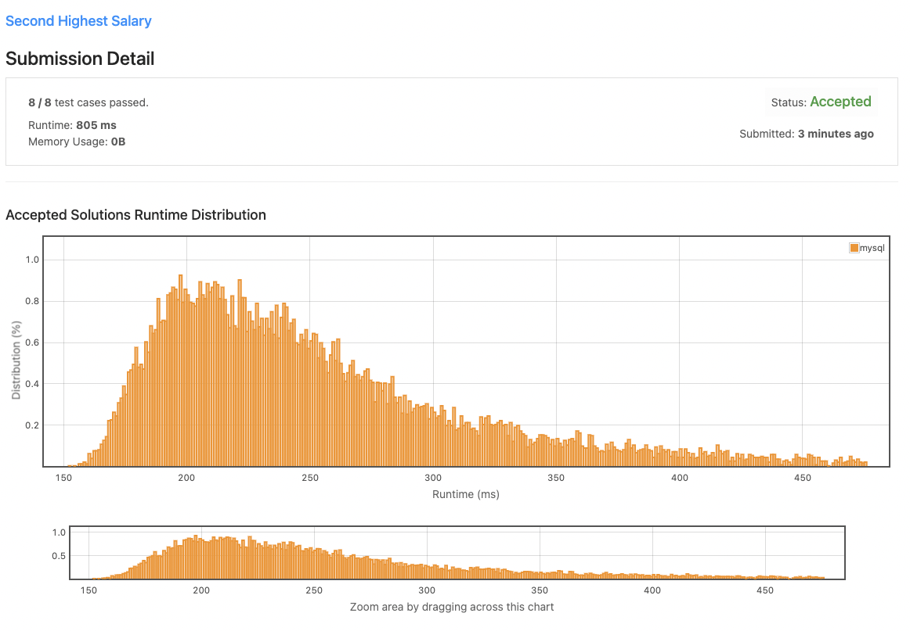

# Question

## SQL Schema

```sql
Create table If Not Exists Employee (id int, salary int)
Truncate table Employee
insert into Employee (id, salary) values ('1', '100')
insert into Employee (id, salary) values ('2', '200')
insert into Employee (id, salary) values ('3', '300')
```

Table: `Employee`

```
+-------------+------+
| Column Name | Type |
+-------------+------+
| id          | int  |
| salary      | int  |
+-------------+------+
id is the primary key column for this table.
Each row of this table contains information about the salary of an employee.

```

Write an SQL query to report the second highest salary from the `Employee` table. If there is no second highest salary, the query should report `null`.

The query result format is in the following example.

**Example 1:**

```
Input:
Employee table:
+----+--------+
| id | salary |
+----+--------+
| 1  | 100    |
| 2  | 200    |
| 3  | 300    |
+----+--------+
Output:
+---------------------+
| SecondHighestSalary |
+---------------------+
| 200                 |
+---------------------+

```

**Example 2:**

```
Input:
Employee table:
+----+--------+
| id | salary |
+----+--------+
| 1  | 100    |
+----+--------+
Output:
+---------------------+
| SecondHighestSalary |
+---------------------+
| null                |
+---------------------+
```

# Answer

```sql
# Write your MySQL query statement below
select 
    max(salary) as SecondHighestSalary
from Employee 
where salary < (select max(salary) from Employee)
```

# 실행 결과
