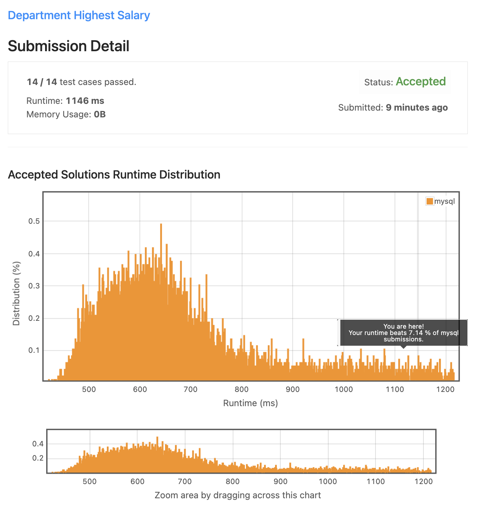

# Question

- `SQL Schema`
    
    ```sql
    Create table If Not Exists Employee (id int, name varchar(255), salary int, departmentId int)
    Create table If Not Exists Department (id int, name varchar(255))
    Truncate table Employee
    insert into Employee (id, name, salary, departmentId) values ('1', 'Joe', '70000', '1')
    insert into Employee (id, name, salary, departmentId) values ('2', 'Jim', '90000', '1')
    insert into Employee (id, name, salary, departmentId) values ('3', 'Henry', '80000', '2')
    insert into Employee (id, name, salary, departmentId) values ('4', 'Sam', '60000', '2')
    insert into Employee (id, name, salary, departmentId) values ('5', 'Max', '90000', '1')
    Truncate table Department
    insert into Department (id, name) values ('1', 'IT')
    insert into Department (id, name) values ('2', 'Sales')
    ```
    

Table: `Employee`

```
+--------------+---------+
| Column Name  | Type    |
+--------------+---------+
| id           | int     |
| name         | varchar |
| salary       | int     |
| departmentId | int     |
+--------------+---------+
id is the primary key column for this table.
departmentId is a foreign key of the ID from theDepartmenttable.
Each row of this table indicates the ID, name, and salary of an employee. It also contains the ID of their department.

```

Table: `Department`

```
+-------------+---------+
| Column Name | Type    |
+-------------+---------+
| id          | int     |
| name        | varchar |
+-------------+---------+
id is the primary key column for this table.
Each row of this table indicates the ID of a department and its name.

```

Write an SQL query to find employees who have the highest salary in each of the departments.

Return the result table in **any order**.

The query result format is in the following example.

**Example 1:**

```
Input:
Employee table:
+----+-------+--------+--------------+
| id | name  | salary | departmentId |
+----+-------+--------+--------------+
| 1  | Joe   | 70000  | 1            |
| 2  | Jim   | 90000  | 1            |
| 3  | Henry | 80000  | 2            |
| 4  | Sam   | 60000  | 2            |
| 5  | Max   | 90000  | 1            |
+----+-------+--------+--------------+
Department table:
+----+-------+
| id | name  |
+----+-------+
| 1  | IT    |
| 2  | Sales |
+----+-------+
Output:
+------------+----------+--------+
| Department | Employee | Salary |
+------------+----------+--------+
| IT         | Jim      | 90000  |
| Sales      | Henry    | 80000  |
| IT         | Max      | 90000  |
+------------+----------+--------+
Explanation: Max and Jim both have the highest salary in the IT department and Henry has the highest salary in the Sales department.
```

# Answer

```sql
select
    d.name as Department,
    e.name as Employee,
    e.salary as Salary
from Employee as e 
join Department as d
    on e.departmentId = d.id
where (e.departmentId, e.salary) in (
        select
					departmentId,
					max(salary)
				from Employee
				group by departmentId
    )
```

## 실행결과



