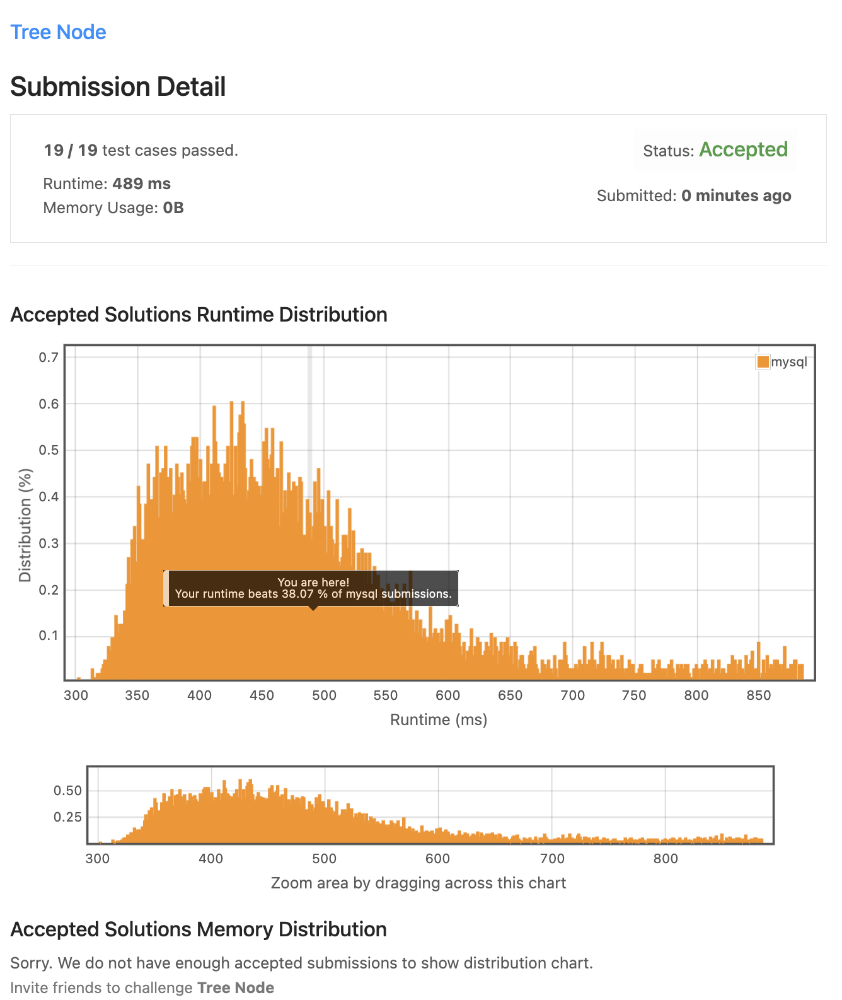

# Question

- `SQL Schema`
    
    ```sql
    Create table If Not Exists Tree (id int, p_id int)
    Truncate table Tree
    insert into Tree (id, p_id) values ('1', 'None')
    insert into Tree (id, p_id) values ('2', '1')
    insert into Tree (id, p_id) values ('3', '1')
    insert into Tree (id, p_id) values ('4', '2')
    insert into Tree (id, p_id) values ('5', '2')
    ```
    

Table: `Tree`

```
+-------------+------+
| Column Name | Type |
+-------------+------+
| id          | int  |
| p_id        | int  |
+-------------+------+
id is the primary key column for this table.
Each row of this table contains information about the id of a node and the id of its parent node in a tree.
The given structure is always a valid tree.

```

Each node in the tree can be one of three types:

- **"Leaf"**: if the node is a leaf node.
- **"Root"**: if the node is the root of the tree.
- **"Inner"**: If the node is neither a leaf node nor a root node.

Write an SQL query to report the type of each node in the tree.

Return the result table **ordered** by `id` **in ascending order**.

The query result format is in the following example.

**Example 1:**


```
Input:
Tree table:
+----+------+
| id | p_id |
+----+------+
| 1  | null |
| 2  | 1    |
| 3  | 1    |
| 4  | 2    |
| 5  | 2    |
+----+------+
Output:
+----+-------+
| id | type  |
+----+-------+
| 1  | Root  |
| 2  | Inner |
| 3  | Leaf  |
| 4  | Leaf  |
| 5  | Leaf  |
+----+-------+
Explanation:
Node 1 is the root node because its parent node is null and it has child nodes 2 and 3.
Node 2 is an inner node because it has parent node 1 and child node 4 and 5.
Nodes 3, 4, and 5 are leaf nodes because they have parent nodes and they do not have child nodes.

```

**Example 2:**


```
Input:
Tree table:
+----+------+
| id | p_id |
+----+------+
| 1  | null |
+----+------+
Output:
+----+-------+
| id | type  |
+----+-------+
| 1  | Root  |
+----+-------+
Explanation: If there is only one node on the tree, you only need to output its root attributes.
```

# Answer

## 첫번째 답안
```sql
select id,
(case when p_id is null then 'Root'
     when id in (select p_id from tree) then 'Inner'
     else 'Leaf' end) as Type
from Tree
```

### 실행 결과


## 두번째 답안

```sql
select distinct t1.id,
(case when t1.p_id is null then 'Root'
    when t1.p_id is not null AND t2.id is not null then 'Inner'
    when t1.p_id is not null AND t2.id is null then 'Leaf'
    end
) as Type 
from tree t1
left join tree t2
    on t1.id = t2.p_id
```

### 실행 결과
